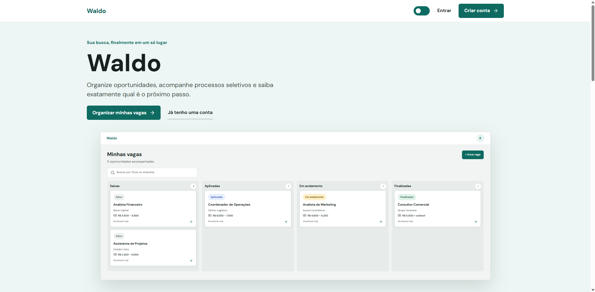
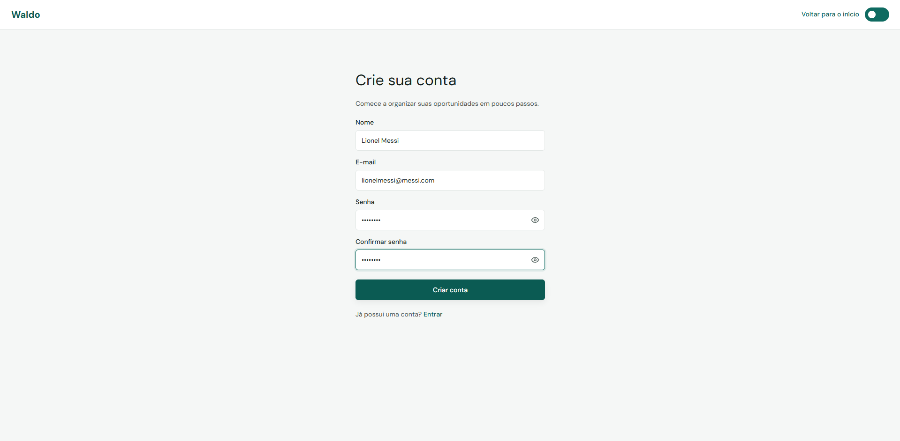
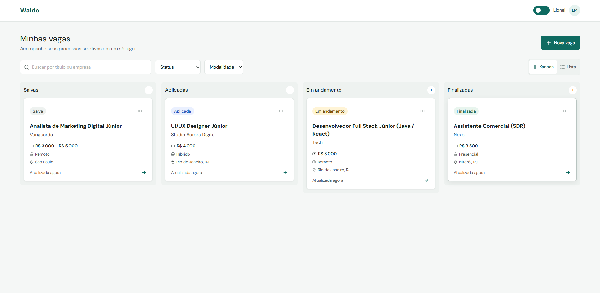
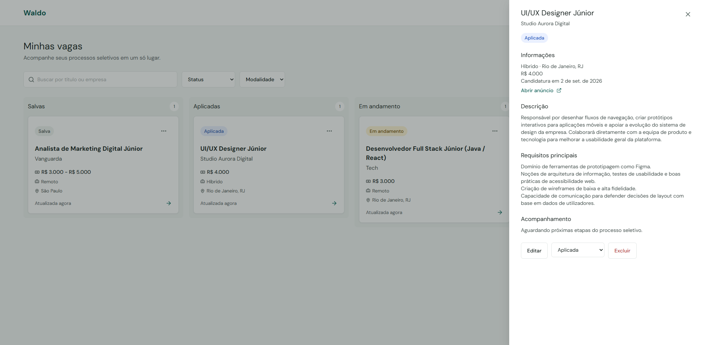
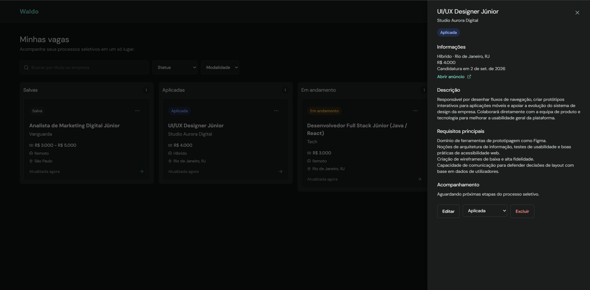

# Waldo

Organize suas oportunidades, acompanhe processos seletivos e saiba exatamente qual e o próximo passo.

Waldo é uma aplicação full-stack para centralizar a busca por emprego em uma experiência simples, visual e prática.

**Demo:** [waldo-2mf.pages.dev](https://waldo-2mf.pages.dev/)

## Visão do produto

O Waldo transforma uma lista dispersa de vagas em um fluxo visual de acompanhamento. Cada oportunidade pode ser cadastrada, filtrada, editada e movida entre etapas do processo seletivo.

## Interface

### Landing page



### Criação de conta



### Dashboard Kanban



### Detalhes da vaga

<table>
  <tr>
    <td></td>
    <td></td>
  </tr>
  <tr>
    <td align="center">Tema claro</td>
    <td align="center">Tema escuro</td>
  </tr>
</table>

## Recursos principais

- Cadastro e login com autenticação JWT.
- Dashboard em Kanban ou lista.
- Cadastro de vaga com status inicial personalizado.
- Busca, filtros por status e modalidade e ordenação.
- Edição, exclusão e atualização de status.
- Drawer com informações completas da vaga.
- Dados isolados por usuário autenticado.
- Tema claro e escuro.
- Interface responsiva para desktop e mobile.

## Stack

### Frontend

React, TypeScript, Vite, React Router, Motion, Lucide React e CSS com tokens de tema.

### Backend

Java 21, Spring Boot, Spring Security, Spring Data JPA, Bean Validation, JWT, Flyway e Maven.

### Infraestrutura

PostgreSQL, Docker, Render e Cloudflare Pages.

## Arquitetura

```text
Cloudflare Pages (React/Vite)
            |
            | HTTPS / REST API
            v
Render (Spring Boot + Docker)
            |
            v
Render PostgreSQL
```

## Executar localmente

### Pré-requisitos

- Java 21
- Node.js e npm
- Docker Desktop

### Banco de dados

No diretório `backend`, crie um `.env` baseado em `.env.example`:

```env
POSTGRES_PASSWORD=defina-uma-senha-local
```

Inicie o PostgreSQL:

```bash
cd backend
docker compose up -d
```

O banco local usa a porta `5433`.

### Backend

Configure as variáveis da aplicação:

```env
DB_URL=jdbc:postgresql://localhost:5433/job_tracker
DB_USERNAME=job_tracker_user
DB_PASSWORD=mesma-senha-do-postgres
JWT_SECRET=secreto_longo_e_aleatorio
JWT_EXPIRATION=28800000
```

Execute:

```bash
./mvnw spring-boot:run
```

No Windows:

```powershell
.\mvnw.cmd spring-boot:run
```

### Frontend

```bash
cd frontend
npm install
npm run dev
```

Acesse `http://localhost:5174`.

## Testes e build

```bash
cd backend
./mvnw test

cd ../frontend
npm run build
```

## Deploy

O backend e executado no Render a partir do `backend/Dockerfile`. O frontend e publicado no Cloudflare Pages com:

```text
Root directory: frontend
Build command: npm run build
Output directory: dist
```

Em produção, o frontend utiliza a variável:

```text
VITE_API_URL=https://<url-publica-do-backend>
```

As credenciais do banco e o segredo JWT devem ser configurados diretamente no provedor, nunca no repositório.

## Possíveis próximos passos

- Recuperação de senha por e-mail.
- Login com Google.
- Histórico de alterações.
- Rate limiting.
- Limite de vagas por usuário.
- Recursos de IA para análise de compatibilidade e documentos personalizados.
